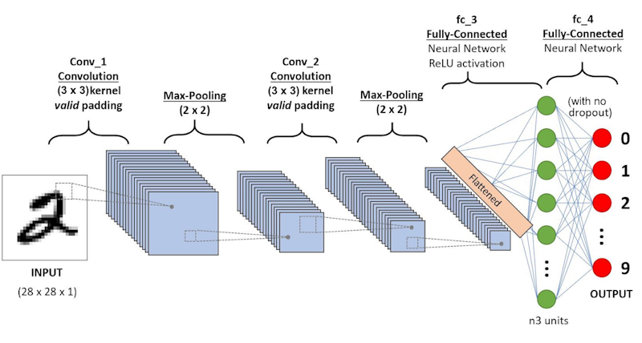
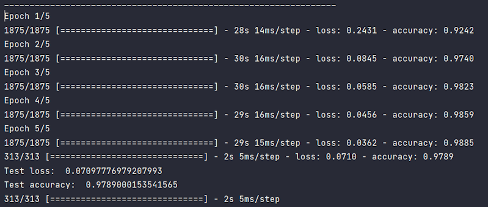

# Handwritten Digit Classification (MNIST, Convolutional Neural Network)

This project presents an implementation of a machine learning model designed to classify handwritten digits with the use
of a Convolutional Neural Network (CNN). The purpose of this project is to explore the realm of computer vision and
pattern recognition by creating a model that can accurately distinguish between different handwritten digits
(ranging from 0 to 9). The project employs the TensorFlow library and Keras API to achieve this classification task.

## Overview

### Data Loading and Preprocessing
At the core of this project is the MNIST dataset, a widely known and used dataset in the field of machine learning.
The MNIST dataset consists of a collection of grayscale images, each representing a single handwritten digit along with
its associated label (the digit it represents). The images are 28x28 pixels in size.

Before feeding the dataset into the CNN, a preprocessing phase is carried out.
This involves normalizing the pixel values of the images, essentially scaling them down to a consistent range, which
aids in the convergence of the model during training. The images are also reshaped to accommodate the CNN's input
requirements.

### Model Architecture
The heart of the project lies in the architecture of the Convolutional Neural Network.
CNNs are particularly well-suited for image classification tasks due to their ability to automatically learn features
from the data through convolutional and pooling layers.

In this project, the CNN architecture is constructed using the Keras Sequential API.
The model consists of three primary components: convolutional layers, activation functions, and pooling layers.
These components work together to capture important patterns and features from the handwritten digits, starting with
simpler elements like edges and gradually moving to more complex characteristics.

### Model Compilation and Training
Once the CNN architecture is established, the next steps are model compilation and training. Compilation involves
specifying the optimizer, loss function, and evaluation metrics. In this case, the Adam optimizer, which adapts the
learning rate during training, is chosen along with the sparse categorical cross-entropy loss function, suitable for
multi-class classification tasks.

The model is then trained using the training data. During training, the CNN's weights are updated iteratively in a way
that minimizes the chosen loss function. This process is driven by the backpropagation algorithm, which calculates
gradients and updates the weights accordingly. Training occurs over a set number of epochs, with data divided into
batches.

### Model Evaluation and Prediction
Following the training phase, the model is evaluated using the test dataset.
This evaluation measures how well the model generalizes to unseen data. The test loss and accuracy provide insights into
the model's performance on data it hasn't encountered during training.

Additionally, the model's prediction capability is showcased by predicting the class label of the first test image.
The argmax function helps identify the predicted digit from the output probabilities produced by the softmax activation
function.

## Conclusion
This project serves as an educational exploration into the realm of CNNs, demonstrating the capability of neural
networks to recognize handwritten digits. Through careful design, preprocessing, architecture construction,
and training, the model is able to learn and distinguish between digits effectively.

For those new to machine learning, this project provides valuable hands-on experience in building and training
neural networks for image classification tasks. It also acts as a stepping stone for further exploration into advanced
topics such as hyperparameter tuning, model evaluation techniques, and the application of CNNs to more complex datasets.