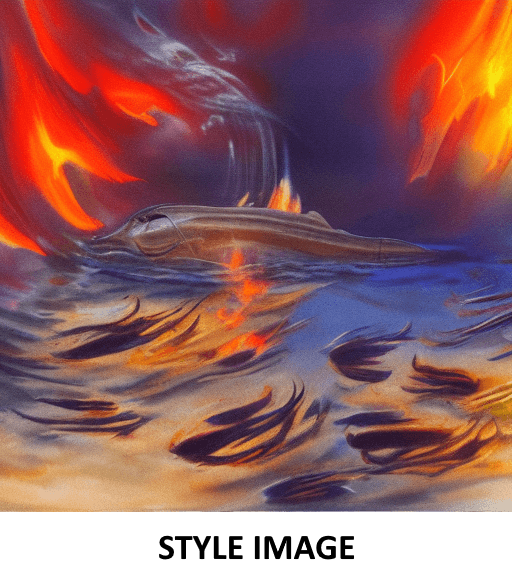
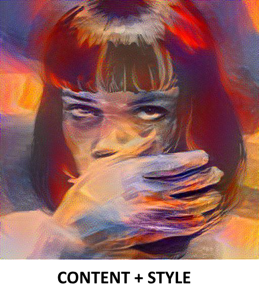
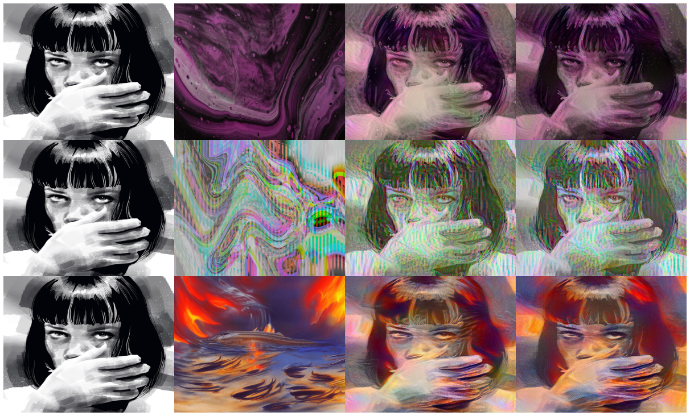

# Neural Aesthetics Style Transfer (Convolutional Neural Network)

Neural Aesthetics Style Transfer (NAST) is a computer vision technique that combines the style of a given image with
the content of another given image. The final output is an image (or multiple images during the process) that is a blend
between the two images. To achieve this, the program uses the TensorFlow library and the Keras API, which provides an
already established neural network that comes pre-trained on ImageNet called 'VGG19'.

## Program Structure

The Neural Aesthetics Style Transfer program is made up of several parts:

### Part I: Prepare, Load, and Display Images

* Load and process the content and style images.
* Functions to load, process, and display images.
* Ensure image pixel values are in the [0, 1] range for proper compatibility
and optimisation with the neural network.

###  Part II: Import VGG19 and Extract Features Maps

* Import the VGG19 model pre-trained on ImageNet.
* Create a stylized model that extracts style and content features from VGG19 layers.
* Extract features maps from both content and style images.

### Part III: Calculate Loss and Optimisation

* Define the Gram matrix function to capture and represent style information.
* Define content loss, style loss, and total loss functions.
* Use gradient descent (Adam optimizer) to minimize the total loss.
* Clip image pixel values to [0, 1] to prevent saturation.

### Part IV: Define Learning Weights and Parameters

* Set weights for total variation, content, and style to control the outcome of the style transfer.
* Determine the number of training epochs and steps per epoch.

### Part V: Training Loop & Final Image Generation

* Iteratively optimize the image to minimize the total loss.
* Monitor and display the loss during training.
* Optionally, save intermediate images at each step.
* Generate and save the final stylized image after training.

## Visual Representation (Collage Of Different Styles With Same Content)

## Dependencies

* TensorFlow
* NumPy
* Pillow aka PIL (Python Imaging Library)
* Matplotlib (image visualization)
* tqdm (bar for tracking training process)

### Training optimisation dependencies

* #### Google Colab

Using Google Colab or another GPU-accelerated cell-based editor for running this Neural Style Transfer (NST) program is
highly recommended for several reasons:

1. Faster Training: NST involves iterative optimization, which can be computationally intensive, especially for
high-resolution images. Running the code on a GPU can significantly speed up the training process,
allowing you to experiment with different parameters more efficiently.

2. Access to GPU Resources: Google Colab provides free access to GPUs (Graphics Processing Units) and 
TPUs (Tensor Processing Units). This access allows you to leverage powerful hardware without the need for 
expensive local GPU setups.

3. Parallel Processing: GPUs are designed to handle parallel tasks efficiently. 
The optimization steps in NST can be parallelized, leading to substantial speed
improvements compared to CPU-based execution.

4. Memory Management: NST may require a substantial amount of GPU memory, especially when dealing with large images
or complex style/content layers. Google Colab offers GPUs with sufficient memory, reducing the risk of running into
memory-related issues.

5. Easy Setup: Google Colab and similar platforms come pre-configured with popular deep learning libraries like
TensorFlow and PyTorch. You don't need to worry about complex GPU driver installations or compatibility issues.

6. No Hardware Constraints: Running NST on a local machine might be limited by the available hardware resources.
Colab, on the other hand, provides access to high-end GPUs, allowing you to work on larger images
and more complex models.

7. Cost-Efficiency: While Google Colab offers free GPU access, even the paid Colab Pro plan is significantly more
cost-effective than purchasing and maintaining a dedicated GPU machine.

8. Collaboration: Google Colab supports real-time collaboration and sharing of notebooks, making it easy to collaborate
with others on NST projects.

9. Jupyter Notebook Integration: Colab uses Jupyter Notebooks, which are an excellent platform for
experimenting and documenting NST projects. You can mix code cells with Markdown cells to provide clear
explanations and visualizations.

10. Cloud Storage Integration: Colab allows you to mount Google Drive and access your cloud storage.
You can easily save and load images and models from your Google Drive, facilitating data management.

11. Resource Management: Colab provides tools to monitor GPU usage, making it easier to manage resources and avoid
overloading the GPU.

12. Support for TPUs: In addition to GPUs, Colab also supports TPUs, which are even more powerful
for deep learning tasks. You can experiment with both GPU and TPU acceleration.

## Conclusion

This program serves as an educational exploration into the capabilities of CNNs, demonstrating the capability of
computer vision and neural networks to recognize, extract and extrapolate artistic patterns and design and apply them
to a completely different context. 

